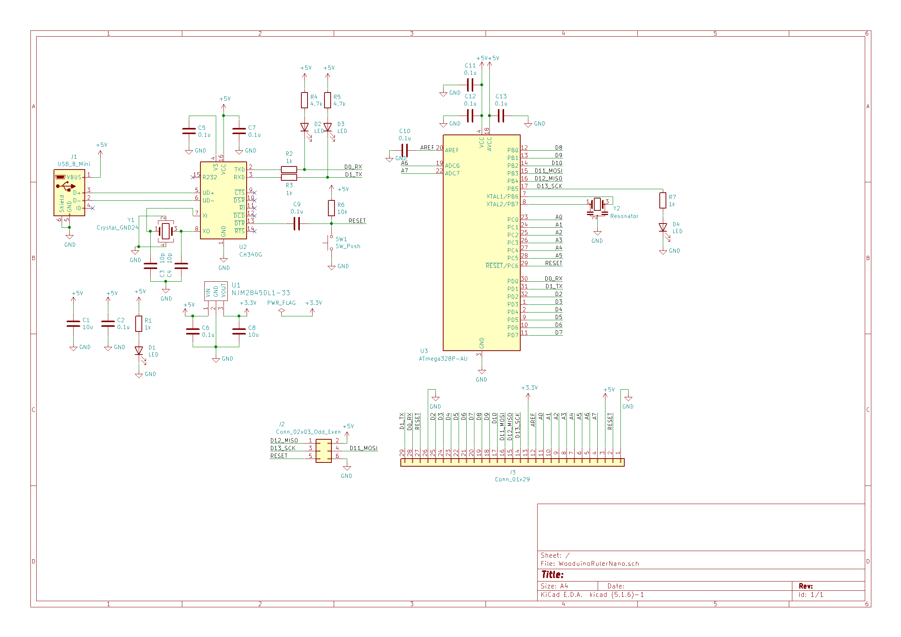
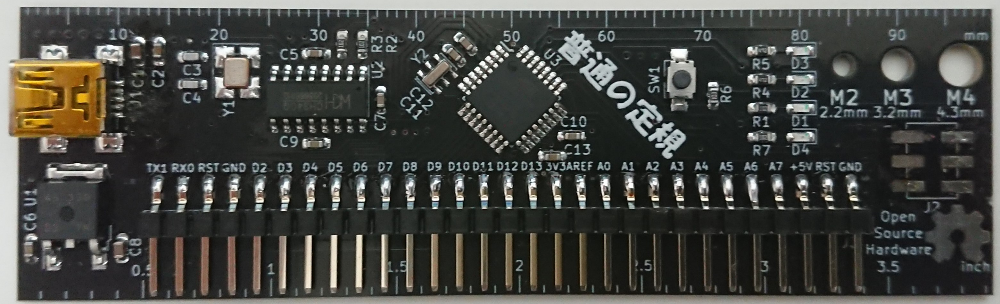
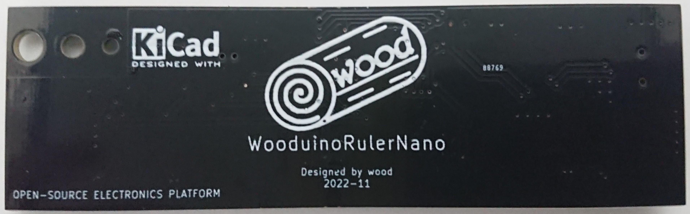

# WooduinoRulerNano
WooduinoRulerNanoは定規風Arduino Nano互換機です。  
定規っぽい見た目なだけでなく、電源電流マシマシに設計していて、3.3Vには800mAの3端子レギュレータを採用していて5Vも配線幅的には2Aほど流せます。Vin端子は使ったこと無かったのでつけていないです。  
[BOOTH](hoge.com)で販売しています。

  
  
  

# 部品・はんだづけについて
add_info/部品表.csvを見てはんだづけを行ってください。  
(ちなみにCH340GではなくCH340Cを使用すればC3,C4,Y1を省略できます)  
向きを間違えやすい4つの箇所を説明します。  

  

1.クリスタル(12MHz)  
赤枠が1番ピンなので赤枠同士が合うようにしてください。裏面の方が分かりやすいので裏面も写真にのせています。  
  

2.CH340G  
〇のマークは1番ピンの意味なので、〇のマークに注目して画像と同様の向きにしてください。  
  

3.ATMEGA328P  
〇のマークは1番ピンの意味なので、〇のマークに注目して画像と同様の向きにしてください。  
  

4.LED  
LEDにはアノード・カソードという端子があり極性があります。写真のような向きにしてください。裏面の方が分かりやすいので裏面も写真にのせています。
  

# ブートローダ書き込みについて
Arduinoはブートローダと呼ばれるプログラムを書きこむためのプログラムを書きこむことで動作します。ここではブートローダの書きこみ方について説明します。  
他のサイトでも紹介されていますが、ArduinoではArduinoを用いてブートローダの書き込みが行えます。  
ここではArduino Unoを用いてWooduinoRulerNanoに書きこみを行う方法を説明します。(WooduinoRulerNanoはArduino Nano互換機なのでArduino Nanoについて解説されている他のサイトも参考にしてみてください)  

※Arduino Unoの代わりにArduino Nanoを用いてもやり方は同じです。Arduino UnoのところをArduino Nanoに読み替えてください。  

1.まずはArduino Unoにブートローダ書き込み用のプログラムを書きこみます。

**現在執筆中、いましばらくお待ちください**

2.Arduino UnoとWooduinoRulerNanoを結線します。  

**現在執筆中、いましばらくお待ちください**

3.ブートローダを書きこみます。

**現在執筆中、いましばらくお待ちください**

(4.Lチカのプログラムを書きこんでみましょう。)  

**現在執筆中、いましばらくお待ちください**