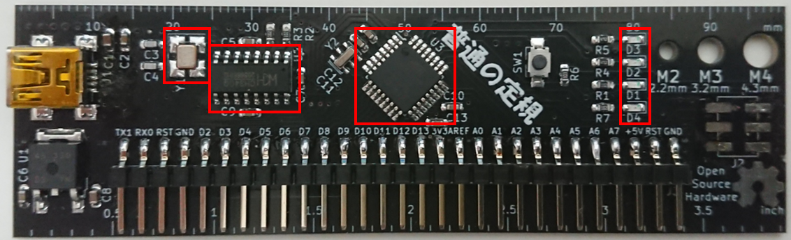
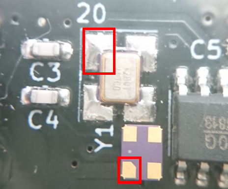
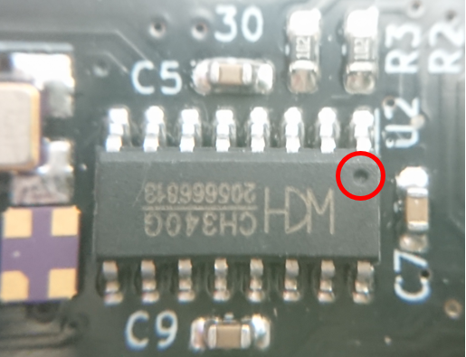
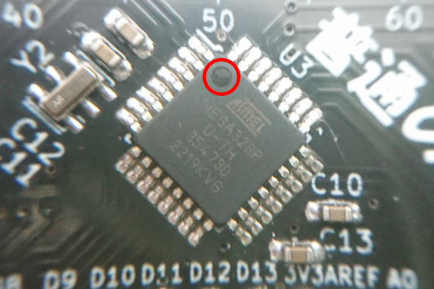
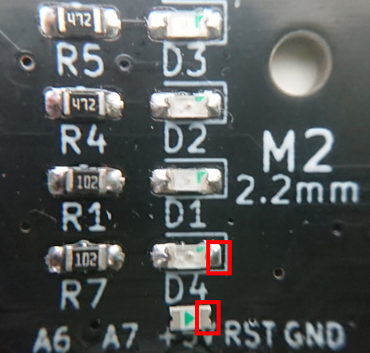

# WooduinoRulerNano
WooduinoRulerNanoは定規風Arduino Nano互換機です。  
定規っぽい見た目なだけでなく、電源電流マシマシに設計していて、3.3Vには800mAの3端子レギュレータを採用していて5Vも配線幅的には2Aほど流せます。Vin端子は使ったこと無かったのでつけていないです。  
[BOOTH](https://woodrobo.booth.pm/items/3751720)で販売しています。

  
  
  

# 部品・はんだづけについて
add_info/部品表.csvを見てはんだづけを行ってください。  
(ちなみにCH340GではなくCH340Cを使用すればC3,C4,Y1を省略できます)  
向きを間違えやすい4つの箇所を説明します。  

  

1.クリスタル(12MHz)  
赤枠が1番ピンなので赤枠同士が合うようにしてください。裏面の方が分かりやすいので裏面も写真にのせています。  
  

2.CH340G  
〇のマークは1番ピンの意味なので、〇のマークに注目して画像と同様の向きにしてください。  
  

3.ATMEGA328P  
〇のマークは1番ピンの意味なので、〇のマークに注目して画像と同様の向きにしてください。  
  

4.LED  
LEDにはアノード・カソードという端子があり極性があります。写真のような向きにしてください。裏面の方が分かりやすいので裏面も写真にのせています。  
  

# ブートローダ書き込みについて
Arduinoはブートローダと呼ばれるプログラムを書きこむためのプログラムを書きこむことで動作します。公式の説明は[ここ](https://docs.arduino.cc/built-in-examples/arduino-isp/ArduinoISP)。  
ここではArduino Unoを用いてWooduinoRulerNanoに書きこみを行う方法を説明します。(WooduinoRulerNanoはArduino Nano互換機なのでArduino Nanoについて解説されている他のサイトも参考にしてみてください)  

※Arduino Unoの代わりにArduino Nanoを用いてもやり方は同じです。Arduino UnoのところをArduino Nanoに読み替えてください。 それ以外のArduinoから書き込みを行いたい場合は他のサイトを参照してください。 

**テスト環境**  
ArduinoIDE 1.8.13  
Windows 10

**1.まずはArduino Unoにブートローダ書き込み用のプログラムを書きこみます。**

ファイル->スケッチ例->ArduinoISP->ArduinoISPを開きます。  
Arduino Unoに書きこみます。  

**2.Arduino UnoとWooduinoRulerNanoを結線します。**

書き込みには以下の表に示すように6本の配線が必要です。配線時にはどちらも電源供給は行わないでください。RESETの機能に関しては書き込み機と書き込み対象でピンが違うので注意してください。

|  機能  |  書き込み機(Arduino Uno)  |  WooduinoRulerNano
| ---- | ---- |  ----  |
|  MOSI  |  11  |  11  |
|  MISO  |  12  |  12  |
|  SCK  |  13  |  13  |
|  RESET  |  10  |  RESET  |
|  VCC  |  5V  |  5V  |
|  GND  |  GND  |  GND  |

**3.ブートローダを書きこみます。**

書き込み機であるArduino UnoとパソコンをUSBケーブルで接続してください。(WooduinoRulerNanoへはUSBケーブルを**接続しません**)  

ArduinoIDEにて以下のように設定を行います。

- ツール->ボード->Arduino Nano  
- ツール->プロセッサ->ATmega328P  
- 「ツール->シリアルポート」に書き込み装置のArduino Unoのポートを選択
- ツール->書き込み装置->Arduino as ISP

「ツール->ブートローダを書き込む」でSuccessになれば成功です。

**(4.Lチカのプログラムを書きこんでみましょう。)**  

WooduinoRulerNanoとパソコンをUSBケーブルで接続してください。  

ファイル->スケッチ例->01.Basics->Blinkを開きます。  

- ツール->ボード->Arduino Nano  
- ツール->プロセッサ->ATmega328P 
- 「ツール->シリアルポート」にWooduinoRulerNanoのポートを選択
- ツール->書き込み装置->ArduinoISP

書き込んでLチカができたら成功です。  

# トラブルシューティング
Q.WooduinoRulerNanoのUSBまわりがおかしい  
A.WooduinoRulerNanoのUSBシリアル変換にはCH340を使用しているのでUSBドライバがパソコンにインストールされていない可能性があります。CH340のUSBドライバをパソコンに入れてください。